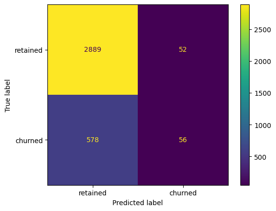

# Waze User Churn Prediction

## Table of Contents

- [Setup Notes](#setup-notes)
- [Project Overview](#project-overview)
- [Introduction](#introduction)
- [Dataset](#dataset)
- [Project Structure](#project-structure)
- [Exploratory Data Analysis](#exploratory-data-analysis-summary)
- [Hypothesis Testing](#hypothesis-testing-summary)
- [Regression Modeling](#regression-modeling-summary)
- [Machine Learning Modeling](#machine-learning-modeling-summary)

---

## Setup Notes

To install the required Python dependencies, run:

```
pip install -r requirements.txt
```

---

## Project Overview

This project aims to build a machine learning model to predict the churn rate of the Waze app, complemented by an in-depth exploratory data analysis (EDA).

[Project Proposal](01-project-proposal-PACE-workflow/Project-Proposal.pdf)

[PACE workflow document](01-project-proposal-PACE-workflow/PACE-strategy-document.pdf)

If you’d like to view the Jupyter notebooks directly, please click the link below:

1. [Initial Exploration](02-initial-exploration/Initial_exploration.ipynb)
2. [Exploratory Data Analysis](03-EDA/eda.ipynb)
3. [Hypothesis Testing](04-hypothesis-testing/hypothesis-testing.ipynb)
4. [Logistic Regression](05-logistic-regression/regression-modeling.ipynb)
5. [Maching Learning Model](06-machine-learning-model/ML-model.ipynb)

---

## Introduction

This guided project was developed as part of the Google Advanced Data Analytics courses and demonstrates the skills I gained throughout the program.

Waze is a community-powered navigation app that helps millions of drivers find the fastest, safest routes. Since user engagement fuels the accuracy of real-time traffic updates, understanding and reducing churn(when users stop using the app) is essential for maintaining Waze’s value and growth.

In this project, we analyzed one month of activity data from 14,999 users, covering metrics such as app sessions, driving behavior, navigation to favorite locations, and device type. Using a structured approach of exploratory data analysis, hypothesis testing, and predictive modeling (logistic regression, Random Forest, and XGBoost), we aimed to:
	•	Identify behavioral patterns that separate retained users from churned ones
	•	Statistically compare differences across user segments (e.g., Android vs. iPhone)
	•	Build and evaluate models to predict churn with practical accuracy

The insights and models generated provide a foundation for product and marketing teams to spot at-risk users, tailor strategies, and improve retention.

---

## Dataset

The dataset contains 14,999 unique users with 12 features collected over one month.

| Column                      | Type  | Description                                                 |
| --------------------------- | ----- | ----------------------------------------------------------- |
| `label`                   | obj   | Target: “retained” vs “churned”                         |
| `sessions`                | int   | Number of times the app was opened during the month         |
| `drives`                  | int   | Number of days driving ≥ 1 km during the month             |
| `device`                  | obj   | Device type used to start a session (e.g., Android, iPhone) |
| `total_sessions`          | float | Estimated total sessions since onboarding                   |
| `n_days_after_onboarding` | int   | Days since user signed up                                   |
| `total_navigations_fav1`  | int   | Navigations to favorite place #1 since onboarding           |
| `total_navigations_fav2`  | int   | Navigations to favorite place #2 since onboarding           |
| `driven_km_drives`        | float | Total kilometers driven during the month                    |
| `duration_minutes_drives` | float | Total driving duration in minutes                           |
| `activity_days`           | int   | Days the app was opened during the month                    |
| `driving_days`            | int   | Days driving ≥ 1 km during the month                       |

---

## Project Structure

<pre>
waze-google-advanced-data-analytics-project/
├── 01-project-proposal-PACE-workflow
├── 02-initial-exploration
├── 03-EDA
├── 04-hypothesis-testing
├── 05-logistic-regression
├── 06-machine-learning-model
├── charts                                 
├── images
├── requirements.txt
└── README.md
</pre>

---

## Exploratory Data Analysis Summary

[eda.ipynb](03-EDA/eda.ipynb)

[Executive Summary](03-EDA/eda-executive-summaries.pdf)

Through EDA, we uncovered several strong indicators of churn:

1. **Frequency of Use**

   

- 40% of users with zero usage churned.
- No user who opened the app all 30 days churned.

  The churn rate is highest among users who used Waze infrequently or not at all in the past month. More driving days in the month correlated with lower churn rates.

2. **Distance per Driving Day**

   

- Higher average km per driving day linked to increased churn risk.

3. **Churn Rate by Device Type**

   
   The  ratio  of  churned  to  retained users  is  similar  across  different device types.

4. **User Tenure & Distributions**

- Tenure ranged from completely new users to ~10 years on the platform.
- Most features exhibited right-skewed or uniform distributions.
- Implausible outliers detected in `driven_km_drives`, `activity_days`, and `driving_days`.

### EDA Recommendations

1. Collaborate with product teams to understand long-distance drivers’ behavior.
2. Conduct deeper statistical analyses on other variables.

---

## Hypothesis Testing Summary

[hypotheses-testing.ipynb](04-hypothesis-testing/hypothesis-testing.ipynb)

[Executive Summary](04-hypothesis-testing/hypothesis-testing-Executive-summaries.pdf)


Designed a two-sample t-test to compare average drives between Android and iPhone users:

- Mean drives: 66 (Android) vs 68 (iPhone).
- Difference not statistically significant (p > 0.05).

---

## Regression Modeling Summary

[regression-modeling.ipynb](05-logistic-regression/regression-modeling.ipynb)

[Executive Summary](05-logistic-regression/regression-modeling-executive-summary.pdf)

Built and evaluated a binomial logistic regression to predict churn:

- **Performance**

  

  - Precision: ~52% (positive predictions correct)
  - Recall: ~9% (detected churned users)

- **Feature Insights**

  

  - `activity_days` was the strongest predictor (more activity → lower churn).
  - `km_per_driving_day`, despite EDA signal, ranked near the bottom in importance.

**Recommendation:** Model offers insights but is not robust enough for major decisions. Gather more targeted data and refine feature set.

---

## Machine Learning Modeling Summary

[ML-model.ipynb](06-machine-learning-model/ML-model.ipynb)
[Executive Summary](06-machine-learning-model/ML-model-executive-summary.pdf)

Compared Random Forest vs XGBoost on train/validation/test splits:

- **Model Performance:**

  |   | model   | precision | recall   | F1       | accuracy |
  | - | ------- | --------- | -------- | -------- | -------- |
  | 0 | RF val  | 0.456522  | 0.124260 | 0.195349 | 0.818531 |
  | 0 | XGB val | 0.430464  | 0.128205 | 0.197568 | 0.815385 |


  - XGBoost is preferred for churn prediction due to better performance on key metrics.
    - It achieves higher recall (0.128) and F1-score (0.198) on the validation set compared to Random Forest.
    - This means it identifies churned users more effectively while maintaining a good balance with false positives.
    - Although its accuracy is slightly lower, this is acceptable since churn prediction involves an imbalanced dataset.
    - In such cases, recall and F1-score are more important than overall accuracy.
  - Recall improved to ~14% (vs. 9% for logistic regression).

- **Engineered Features Dominate:**
  

  - Top predictors include `km_per_hour`, `percent_of_drives_to_favorite`, `total_sessions_per_day`, `percent_sessions_in_last_month`, `km_per_driving_day`, `km_per_drive`.
  
- **Interpretability Trade-off:**

  - Tree ensembles yield better accuracy but are less transparent.

**Recommendation:** To enhance churn prediction, it is important to gather more detailed drive-level data, such as timestamps and locations, along with comprehensive user interaction logs that reflect in-app behavior and feature usage.
